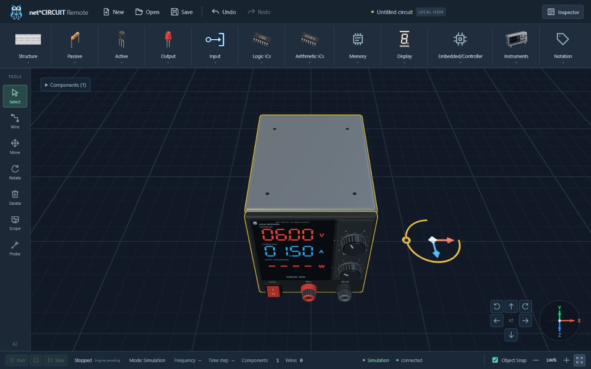

# Điều khiển Power Supply 3D

- Chọn **Select**, giữ chuột trái trên núm **Voltage** hoặc **Ampe** rồi kéo lên/phải để tăng, xuống/trái để giảm. Núm, rãnh grip và vạch chỉ thị xoay đồng thời, cập nhật ngay khi kéo; hành trình giới hạn 270°.
- Núm nhỏ hơn khoảng 14% so với phiên bản cũ. Thang số quanh núm: **Voltage 0–15 V**, **Ampe 0–5 A**; vạch chỉ thị khớp thang 270°. Giá trị đặt thay đổi theo bước 0,01 V/A.
- Bấm công tắc **I/O** để bật/tắt. Mặt công tắc và chữ I/O nghiêng cùng nhau; màn hình đổi độ sáng và trạng thái POWER ON/OFF. Màn hình V/A cập nhật giá trị đặt ngay khi kéo, có nhãn **VOLTAGE SET / CURRENT LIMIT**.
- Icon **favicon.svg** của dự án được gắn tại phần trên của mặt trước nguồn, giữ cùng vị trí khi di chuyển/xoay mô hình.
- Thả chuột hoàn tất một lần chỉnh; **Undo/Redo** hoàn tác/khôi phục. **Esc**, đổi công cụ hoặc hủy pointer khôi phục núm về trạng thái trước khi kéo.
- **Move** vẫn kéo cả mô hình, kể cả khi nắm tại núm. Các thao tác chỉnh núm/công tắc chỉ hoạt động trong **Select**.
- Trạng thái riêng của từng nguồn được lưu trong file mạch: `voltage_v` trong khoảng 0–15, `current_limit_a` trong khoảng 0–5 và `power_on` dạng boolean. Mạch cũ thiếu các trường này hiển thị hai núm ở 0 và công tắc OFF.
- V/A là **giá trị đặt cục bộ**, không phải số đo đầu ra. W vẫn chưa biết; chưa tạo nguồn điện, cổng điện, tín hiệu hardware hay số đo thực.

Kiểm tra trực tiếp trên trình duyệt: kéo Voltage đến 6,00 V, Ampe đến 1,50 A, bấm công tắc ON; Undo về OFF và Redo về ON. Vị trí nguồn không thay đổi. Thay đổi metadata khi Vite đang chạy có thể cần tải lại trang để store đang mở nhận contract mới.

Xác minh: `npm test` 88/88 PASS; `vue-tsc --noEmit` PASS; context check PASS. Bộ kiểm tra Python frontend/docs/context có 16/17 PASS, một lỗi provenance vì file gốc `assets/icon .svg/power_supply.svg` đang thiếu; chưa thay đổi artwork gốc hay manifest trong lần chỉnh này.

