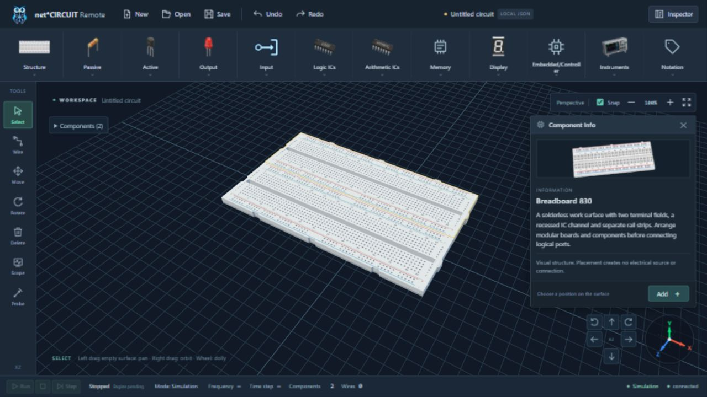

# Selection and Component Info verification — 2026-10-09

## Automated regression

`cd apps/web && npm test`: **62/62 PASS** on the final source, zero failures, including vue-tsc. New tests were RED before their respective corrections: mesh cage, absent recessed channels, reuse of a disposed selection outline, missing passive Info opening, static curved contour and resistor bands hiding the body outline. The last raycast regression measured 44 hidden contour samples before correction and zero afterward. Flush paint bands use a material depth offset to prevent coplanar flicker. Production picking/editor/camera/history behavior remains active in the tests. Full tests ran outside the Windows sandbox because loopback API tests otherwise receive EACCES.

Production build **passed earlier in this change**, with 117 modules and Vite's existing >500 kB chunk advisory. The final outside-sandbox build request was rejected by the user. A safer final `npm run build` inside the sandbox passed its production TypeScript check, then Vite failed with `EPERM` resolving `apps/web/src/main.ts` via realpath. Final production bundling is therefore **not verified** after the minor focus/layout/Board/resistor refinements. No further build escalation was requested. No new dependencies, electrical contracts or driver imports.

Documentation/cross-boundary checks: **17/17 PASS** (`tests/frontend`, `tests/test_docs_baseline.py`, `tests/integration/test_context_integrity.py`); `scripts/check_context.py` PASS. Independent code review found no Critical/Important issues. Its two minor findings were corrected: valid Board fallback introduction and decorative resistor bands occluding contour edges.

## Native browser checks

Codex in-app browser, `http://localhost:5173/`, actual WebGL and session-local test draft.

1. Baseline reproduced the thick yellow box cage and action card including Rotate/Delete/Properties/Info & Pinout, incorrect 0 Ports and cm dimensions on Breadboard 830.
2. Selected the rebuilt breadboard. Its thin contour follows housing/joints and leaves body color unchanged; a real recessed channel is visible. Component Info opens at the upper right.
3. Clicked Add Breadboard 830: status still one component and hint becomes PLACE BREADBOARD. Only a surface click increases the count to two. Existing docking aligns the boards.
4. With Move active and Info open, dragged BREADBOARD_2 from X≈-1.5/Z≈-2.16 to X=1.5/Z=-4.5. One Undo restores X≈-1.5/Z≈-2.16 and retains both models. A short drag within the magnetic zone stays docked as intended.
5. Repeated the large drag in Select: Inspector coordinates stay unchanged. Move-only behavior remains.
6. Added an LED using Inspector; Info changes to LED introduction/artwork/Add. Two Orbit right actions update view, XYZ and its thin contour. Undo removes that test LED; selecting BREADBOARD_2 restores its introduction.
7. DOM verification: exactly one `.component-information`, exactly two panel buttons (`Close Component Info`, `Add Breadboard 830`), zero `.workspace-info-card` elements. The information panel has no edit/delete/pinout buttons. Inspector retains its ordinary editing capabilities.
8. Browser warning/error log query returns `[]` after final changes. Desktop viewport overrides reset after checks; tab retained for reviewing the result.
9. Final Board fallback check: adding a supported Board through Inspector shows its visual-work-surface introduction and enabled Add Board, rather than an unsupported-import message. Undo restores the draft. A resistor smoke check opens its artwork/introduction/Add panel without browser warnings/errors; its unobstructed contour is verified by the raycast regression above.

## Desktop bounds

| Viewport | Horizontal overflow | Panel inside workspace | Panel above navigator | Full body visible / Add visible |
|---|---|---|---|---|
| 1920×1080 | No | Yes | Yes | Yes |
| 1440×900 | No | Yes | Yes | Yes |
| 1366×768 | No | Yes | Yes | Yes |
| 1280×720 | No | Yes | Yes | Yes |

The 1280×720 bounds were re-read after the asynchronous viewport resize settled. Smaller windows allow the panel body to scroll while the Add footer remains accessible. Existing native right-drag automation limitation remains; right-button OrbitControls integration tests pass. No hosted CI, deployment, simulation execution or physical acquisition is claimed.

