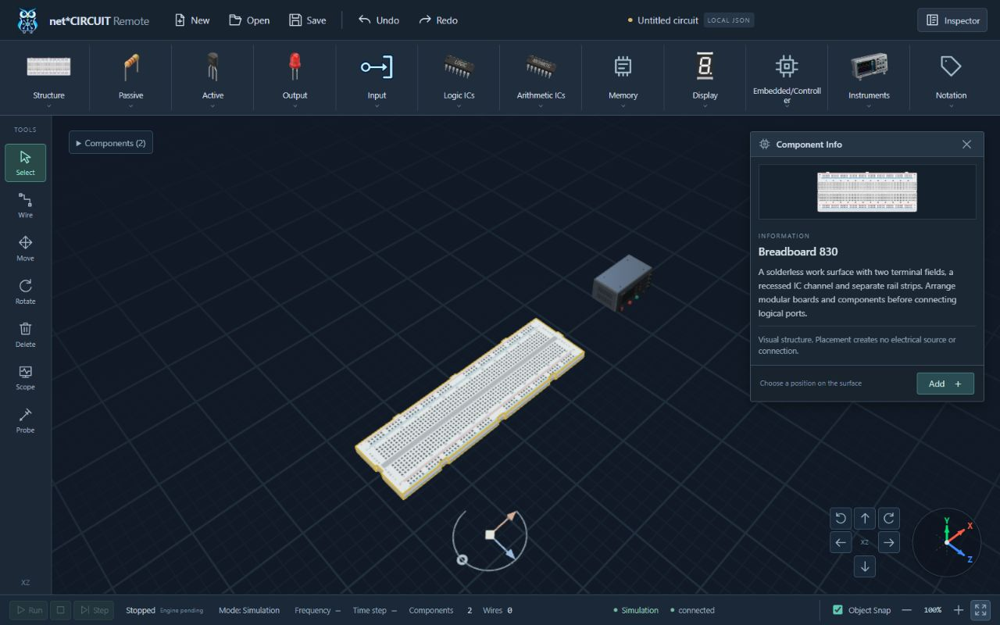
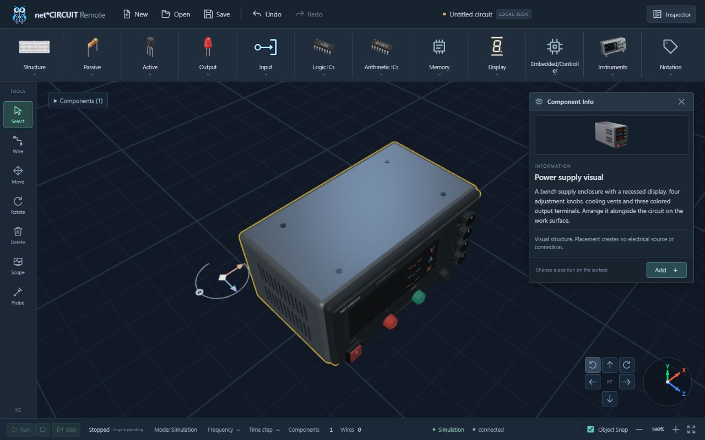

# Component Transform Gizmo verification — 2026-10-09

## Automated evidence

- Final `cd apps/web && npm test`: **79/79 PASS**, including Vue/TypeScript checks. Eleven new regressions cover fit bounds, gizmo ray picking/hover/scale/following/disposal, X/Z/free gestures, live named endpoints, rotation, cancellation/selection changes, arbitrary-angle snap and window avoidance.
- `python -X utf8 -m pytest -q tests/frontend tests/test_docs_baseline.py tests/integration/test_context_integrity.py`: **17/17 PASS**. Windows default cp1252 initially failed two existing UTF-8 document checks; explicit UTF-8 mode passes without altering those tests.
- `python -X utf8 scripts/check_context.py`: PASS. `git diff --check`: PASS.
- Final `npm run build`: production Vue/TypeScript step passes; Vite fails with `[vite:build-html] EPERM ... realpath apps/web/src/main.ts` in sandbox. **Final production bundle NOT VERIFIED.** Prior build-elevation decline respected; no workaround or repeat escalation. API tests use the authorized outside-sandbox npm test because loopback calls otherwise receive EACCES.
- Fresh-context read-only review found two P2 issues: single-use neighbor iterator and active-drag scale. Both were reproduced by new RED tests and fixed; final suite is green. No dependencies or electrical contracts changed; no commit/push/deploy/hosted CI run.

## Native browser evidence

Codex in-app browser, localhost:5173, session-local test draft, real WebGL:

1. Loaded a fresh page at 14:12 UTC after store interface changes. Empty draft has no Component Info; Fit Entire Circuit is disabled. New toolbar has defined aria/title labels and Workspace Object Snap checkbox; Perspective and generic tool-title overlay are absent.
2. Added Breadboard 830 and Power Supply through Inspector. Moved supply to X=6 with existing canvas arrow commands. Fit Entire Circuit frames both separated objects; orbit buttons rotate view and XYZ as before.
3. Native left drag of supply's X handle changes **X 6 → 8.5**, retains **Y=0, Z=0**. Inspector reads committed values. One Undo restores X=6; Redo restores X=8.5. Select remains active while explicitly dragging the handle.
4. Native drag of Y arc changes supply rotation **0° → 75°**, preserving X=8.5/Y=0/Z=0. One Undo returns to 0°. Integration tests also verify continuous preview, 15° snapping and named port movement.
5. Selected breadboard: native diamond drag changes **(X,Z) (0,0) → (2,1.5)**, retaining Y=0. One Undo restores the original pose. Gizmo chooses a clear location beside the model when the Info window occupies the right side.
6. Power Supply close-up uses a temporary reversible removal of the test breadboard; Undo restores it afterward. Rounded metal housing, printed front, dark unknown/OFF readouts, four fluted knobs, colored decorative terminals, vents, switch, feet and screws render. Gold contour follows case/bezel without rings around individual controls. No source/port is created.
7. Zoom In changes display to 110%; Fit restores 100% and frames graph geometry. Window/navigator regions participate in gizmo placement. Pointer paths remain canvas-native; no injected graph/store state or synthetic page events used.
8. Warning/error logs **since the fresh load at 14:12:04 UTC: `[]`**. Earlier dev hot reload retained the old store and emitted missing-fit-action errors; reload resolved the stale development instance before final verification. These historical entries are not hidden or claimed absent from the entire session.
9. Temporary viewport overrides reset; tab retained as deliverable. Right-button orbit remains covered by genuine OrbitControls pointer integration; native right-drag automation is not claimed here.

| Actual viewport | Horizontal overflow | Toolbar inside footer | Right inset | Old overlay selectors |
|---|---|---|---|---|
| 1440×900 | None | Yes | 12 px | 0 |
| 1280×800 | None | Yes | 12 px | 0 |
| 1024×768 | None | Yes | 12 px | 0 |
| 662×622 (661 requested; browser rounding) | None | Yes | 12 px | 0 |

## Practical limits

Object Snap and conservative rotated AABBs assist arrangement; neither establishes electrical connectivity or exact physical mating at arbitrary angles. Candidate placement picks the best available location in crowded scenes rather than performing a full physical collision solver. Component Info/instrument windows may still cover graph geometry; they can be closed, while the gizmo separately avoids their regions. Magnification buttons and wheel dolly are distinct view operations. Supply controls/readouts are visual-only.
