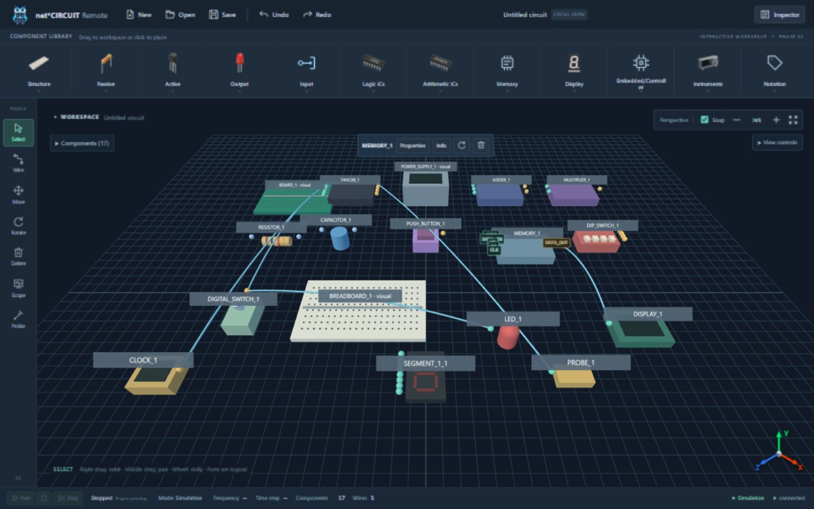

# Phase 2 verification — 2026-10-09

Result: **PASS** for the requested interactive workspace scope. Local Vite at `http://localhost:5173/`, real FastAPI backend at port 8000; simulation station discovery and event WebSocket connected. Browser controlled through Codex computer-use APIs, with native mouse/keyboard gestures for canvas and coordinate inputs. No synthetic simulator, signal readings or hardware source was introduced.

## Automated checks

| Check | Final result |
|---|---|
| `npm test` | **43/43 PASS**; TypeScript check plus runtime API/store/file/catalog/memory/scene/WebSocket tests |
| `npm run build` | **PASS**, 111 modules; existing Vite large-chunk advisory, no build error |
| Python full repository suite | **56/56 PASS**, 3 existing dependency warnings |
| `python scripts/check_context.py` | **PASS** |
| Frontend CI boundaries | Included in passing Python suite; metadata/icon provenance, centralized API calls and allowed imports preserved |
| Hosted CI | Not run: no push/PR was requested; local workflow checks passed |

Windows sandbox blocked loopback HTTP and Vite realpath. Commands were rerun with approved execution outside it. The Python sandbox run also stalled in API tests; the approved full run finished successfully. No source change was made to disguise these environment limitations.

## Browser scenarios

| Scenario | Observed result |
|---|---|
| Native ribbon drag/drop | Breadboard dropped into scene; module count changed 0 → 1; no electrical ports appeared |
| Click placement | Toggle switch and LED placed at clicked surface positions; snap grid preserved coordinates |
| Named-port wiring | Switch OUT → LED IN created exactly one edge and visible wire |
| Move gesture | Dragged switch; Inspector showed X=-7, Z=1.5. One Undo restored X=-4.5, Z=3.5; Redo restored move. Edge IDs remained unchanged |
| Rotate | 90° rotation persisted in Inspector and downloaded JSON; connected wire followed its logical anchor |
| Unwire/delete | Inspector disconnect updated count; Undo restored edge. Module Delete removed incident wire; Undo restored both |
| Direct wire picking | Near-wire pointer selection + keyboard Delete changed 5 → 4 wires; Undo restored 5 after picking margin fix |
| JSON round trip | Save/New/Open restored geometry, rotation=90°, logical edge and memory image bytes |
| Memory | Applied `AF 01 41 42 00 FF` (6-byte image); Undo restored explicit 32 zero bytes; Redo restored edited bytes. `GG` rejected without replacing image. Reopened JSON preserved bytes |
| Required catalog | All 17 types added/configured/rendered; board/supply remained visual-only. Adder/Multiplier remained generic abstractions |
| Metadata logic/bus | CLOCK OUT → 74HC08 A1, toggle OUT → B1, Y1 → Probe IN and Memory DATA_OUT → Display DATA succeeded; scalar clock → 8-bit address rejected with width error, count unchanged |
| View | Orbit/Pan controls changed perspective/position; zoom updated to 110%; reset restored view; snap toggle remained available |
| Escape regression | Before fix: palette placement/DOM-port pending wire survived Escape. After fix: both canceled; floating Inspector still closed with Escape |
| API / events | Backend returned structurally valid graph; WebSocket connected and real simulation station discovered |
| Browser console | No warning/error entries in the tested session |

Coordinate forms were tested with native keyboard entry and blur; the browser connector's fill alone does not reproduce a native input change event. Covered floating-window buttons were brought to front before using Escape/close. These are automation interaction details, not editor workarounds for users.

## Responsive desktop

Inspector and Hex Editor were simultaneously open for bounds checks. No horizontal body overflow; workspace stayed dominant. Temporary viewport overrides were reset afterwards.

| Viewport | Workspace width × height | Open windows inside |
|---|---|---|
| 1920 × 1080 | 1854 × 867.2 | Both PASS |
| 1440 × 900 | 1374 × 687.2 | Both PASS |
| 1366 × 768 | 1300.4 × 555.2 | Both PASS |
| 1280 × 720 | 1214 × 507.2 | Both PASS |

## Review and artifacts

One fresh read-only reviewer found missing InstancedMesh buffer disposal and Escape focus coverage. Disposal tests and browser focus cases reproduced failures before fixes. Ghost reuse and pixel-scaled wire picking also have RED → GREEN regressions. The final suite/build above ran after those changes.

Screenshot shows 17 models and five logical connections at desktop size. [Saved Circuit Graph JSON](2026-10-09-interactive-workspace.json) was downloaded through the actual Save action and can be opened with the workbench's Open button. It contains local initial memory configuration, not measured or simulated results.

Scope limits: no runtime simulation, physical pin map/node topology, power source, capture or generator output is claimed. Context-loss handling is implemented; browser manual context-loss injection was not performed. Session persistence remains local file download/import.
