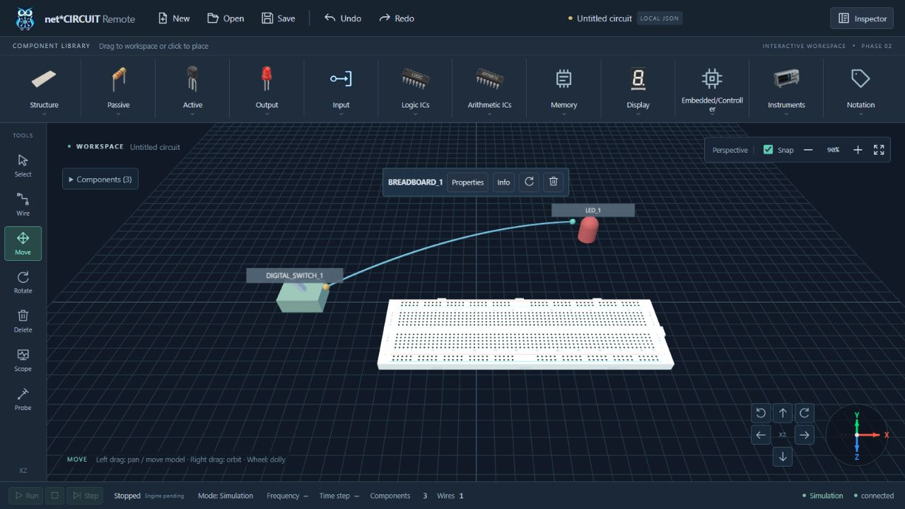

# Move-only model dragging verification — 2026-10-09

Latest requested behavior: direct mouse dragging of breadboards and all other scene models is allowed only with Move active. Select selects models/wires. Empty-surface left pan and right-button orbit remain available.

## Automated checks

| Check | Result |
|---|---|
| `cd apps/web && npm test` | **54/54 PASS**, zero failures; includes vue-tsc |
| `cd apps/web && npm run build` | **PASS**, 113 modules; JS 736.80 kB / gzip 220.73 kB |

The new Select test was RED before the guard change: dragging previewed the breadboard at X=1.5/Z=1 instead of leaving it at the origin. GREEN verifies actual production picking/editor/scene/store behavior for breadboard and LED: selected ID updates, but geometry, graph, camera, capture and history do not move/change. Positive Move tests still cover snapped movement, preserved elevation/endpoints, one commit, Undo/Redo, pointer identity, low-angle picking, cancel and switching to Select during a preview. Existing pan and right-button OrbitControls tests also pass.

Commands ran outside the Windows sandbox because its loopback restrictions prevent HTTP tests and Vite realpath. The existing Vite large-chunk advisory remains; there is no build error.

## Native browser checks

Codex in-app browser at `http://localhost:5173/`, real WebGL scene, existing test draft with three components and one connection `DIGITAL_SWITCH_1.OUT → LED_1.IN`.

1. Inspector initially reports breadboard X=1.5/Y=0/Z=1.5.
2. With Select active, native left drag from `(740,475)` to `(820,515)` leaves the breadboard at X=1.5/Y=0/Z=1.5. The selected component stays BREADBOARD_1.
3. Activate Move and perform the same native drag. Inspector reports X=3/Y=0/Z=2.5. The workspace hint now advertises model dragging.
4. Click Undo once: Inspector reports X=1.5/Y=0/Z=1.5 again. Counts remain three components/one wire; named endpoints are intact.
5. Warning/error log query returns `[]`. Close Inspector and retain Move active for the screenshot.

This update does not repeat the four desktop sizes or native pan/button checks from the [previous navigation report](2026-10-09-workspace-navigation-browser.md). Right-button native drag is unavailable in the current automation API; the production OrbitControls integration test passes. No dependency, electrical contract or driver change was needed.

