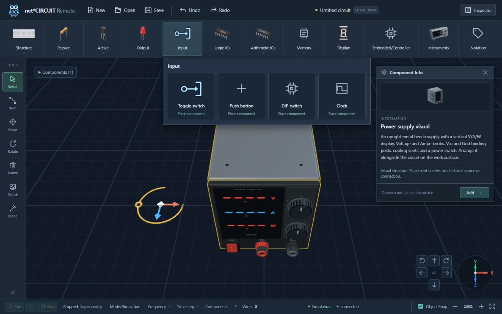
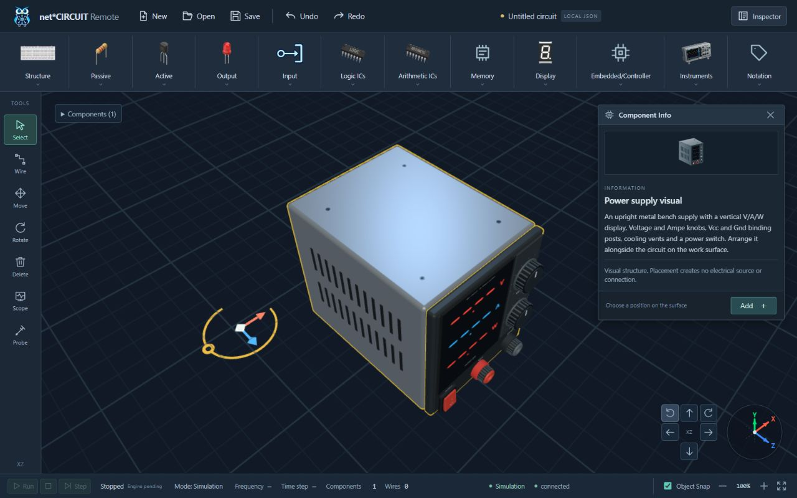
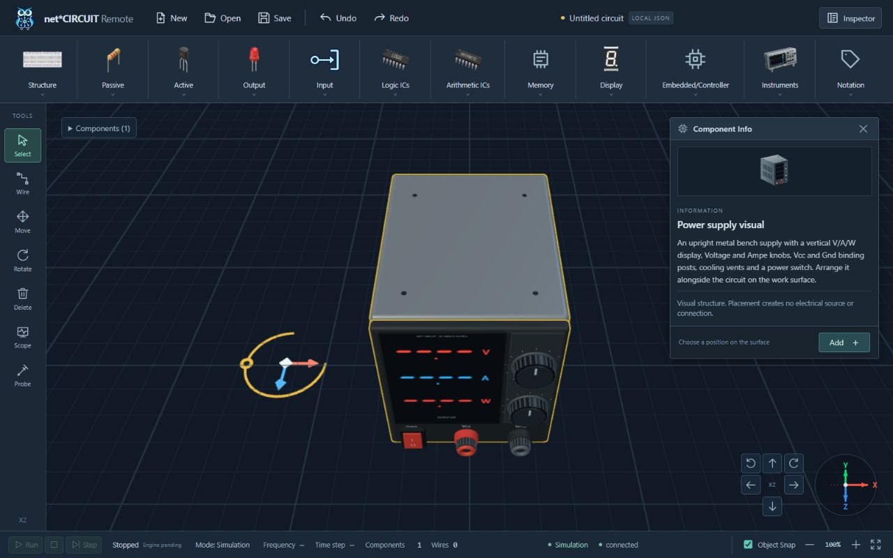

# Ribbon, gizmo and upright supply verification — 2026-10-09

Target: local development workbench at `http://localhost:5173/`, real Three.js/WebGL in the Codex in-app browser. Final-source fresh reload: **2026-10-09T15:44:13.705Z**. Only a session-local test draft was used; no circuit was saved or submitted for hardware execution.

## Ribbon and responsive layout

The Input palette at 1280×800 starts at **x=414.975**, exactly its triggering family's left edge. Width is **530 px**, with four component-choice buttons and no Info buttons. Cards fit without an unnecessary horizontal scrollbar. Escape closes it and restores family focus.

The Embedded/Controller label has one rendered text line at every measured size. Its menu follows the group's on-screen position, shifting left only at the narrow viewport's right boundary. Resizing the already-open menu back to 1280×800, without clicking a group again, gives both trigger and palette x=926.700. The horizontal ribbon scroll required to reach Embedded/Controller in the narrow viewport also recalculates its anchor.

| Observed viewport | Embedded trigger x | Palette x | Palette right | Text lines | Page overflow |
|---|---:|---:|---:|---:|---|
| 1920×1080 | 1406.713 | 1406.713 | 1552.713 | 1 | No |
| 1440×900 | 1046.713 | 1046.713 | 1192.713 | 1 | No |
| 1366×768 | 991.500 | 991.500 | 1137.500 | 1 | No |
| 1280×720 | 926.700 | 926.700 | 1072.700 | 1 | No |
| 662×622 | 546.800 | 505.600 | 651.600 | 1 | No |

The narrow override requested 661 px; DOM `innerWidth` reported 662 px. Measurements record the observed viewport. All palettes stayed inside it. Raw measurements: [JSON](2026-10-09-ribbon-gizmo-layouts.json).

## Native gizmo interaction

Native left-button drags were made at the narrow viewport with Select active, Object Snap on and the supply selected. No store injection, synthetic browser events or renderer replacement was used.

- **Y grip:** drag approximately (84,438)→(185,414). Inspector confirmed **0→120°**, unchanged X/Y/Z. The visible grip moved from the ring's left side to its right side with the model. After release the entire ring remained inside the canvas. One Undo restored 0°; Redo restored 120°; another Undo returned the draft to 0°.
- **X handle:** approximately (176,383)→(212,363). Inspector confirmed X **0→1**, Y=0/Z=0. One Undo returned X to 0.
- **Free diamond:** approximately (138,404)→(182,411). Inspector confirmed **(X,Y,Z)=(0.5,0,0.5)**. One Undo restored (0,0,0).
- During camera orbit the gizmo remained adjacent with clear coral/blue arrows, an ivory diamond and gold ring. The tool's scene geometry stayed separate from component count and logical connections. No Delete/Confirm/Check buttons were added.

Existing runtime regressions also verify the Z handle, Move-only body dragging, live wires, cancellation, foreign-pointer release, stable scale, fixed gesture center and grip picking at 45/90/180/270°. Native tests above cover the newly visible behavior; they do not claim physical execution or measured outputs.

## Power Supply and Component Info

Verified the actual upright metallic mesh from front and oblique views: portrait V/A/W screen, two large fluted Voltage/Ampe knobs, two Vcc/Gnd binding posts, I/O switch, side vents, screws and feet. Screen displays colored unknown-value segments and OUTPUT OFF, never reference-photo measurement values. There is no USB or third terminal.

The Component Info introduction and original vector preview now describe/show the two-knob/two-post layout. Its image stays within the art frame. Clearing selection hides the panel; selecting the supply again reopens it with only Close/Add actions. The ribbon has no Info rows.

## Automated checks and review

- Final `npm test`: **82 tests, 82 PASS, 0 failed**, including test TypeScript checking. Three new regressions plus the updated supply contract test cover rotating grip, projected tall-model clearance, small-canvas post-yaw clearance and genuinely recessed output sockets.
- Independent read-only review found a closed terminal-base cap obscuring the bore. A center ray test reproduced `supply-terminal-0` as the first hit; after the annular/open-base correction, both bores first hit their dark recessed `socket-floor`. Final suite passes.
- Fresh-load browser warning/error logs: **empty**. Earlier HMR/session logs are excluded by the recorded reload timestamp.
- UTF-8 Python frontend/docs/context checks, `scripts/check_context.py` and diff whitespace validation: final results recorded in the completion log below.
- `npm run build`: production TypeScript checking succeeds; Vite remains blocked by sandbox **EPERM realpath `apps/web/src/main.ts`**. The earlier user refusal to elevate build is respected. **Final production bundling and hosted CI are not verified.**

Viewport override was reset; the local browser tab remains available as a deliverable. No dependency installation, commit, push, deployment or hardware operation was performed. User-added reference PNG files remain untouched.

## Completion log

- UTF-8 Python `tests/frontend`, `tests/test_docs_baseline.py`, `tests/integration/test_context_integrity.py`: **17/17 PASS**.
- `python -X utf8 scripts/check_context.py`: **PASS**.
- `git -c core.safecrlf=false diff --check`: **PASS**.
- Final `npm run build`: `vue-tsc --noEmit` completed successfully; Vite 6.4.4 failed before transforming modules with the same sandbox realpath **EPERM**. No escalation was requested again; no final bundle/hosted CI PASS claim is made.
