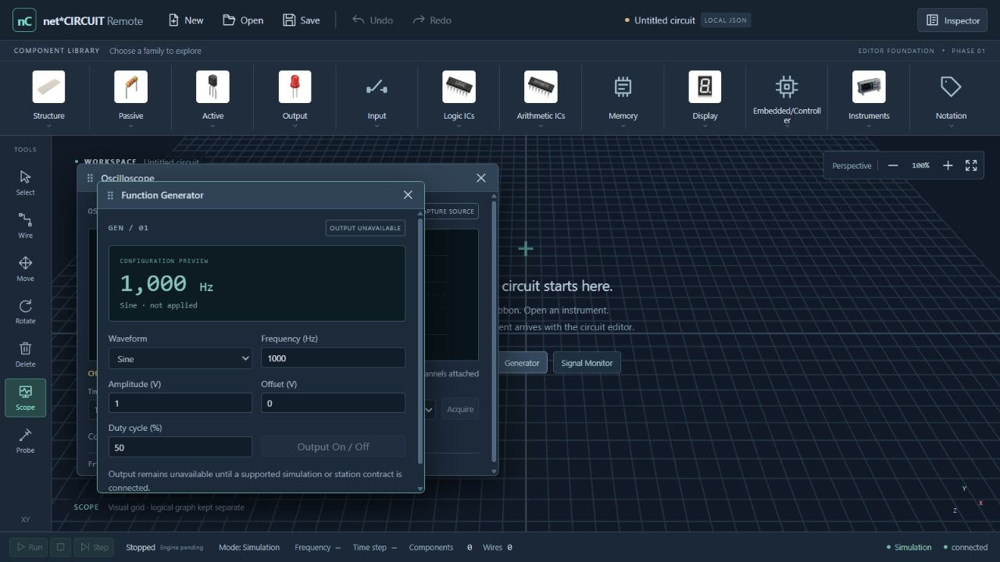

# Single Workspace browser verification — 2026-10-09

Tested the real Vite app at `http://localhost:5173/` in Codex's in-app browser, with the existing FastAPI simulation service at `127.0.0.1:8000`. Temporary browser fixtures were created under ignored `.superpowers/`; no production graph/device data was changed.

The saved screenshot shows the verified 1280×720 workbench with two floating instrument shells and a connected backend. The temporary viewport override was reset after testing. Final browser console inspection returned no warnings/errors after a fresh load with the backend running.

## Layout measurements

| CSS viewport | Workspace width × height | Body horizontal overflow | Scope/Generator inside workspace |
|---|---|---|---|
| 1920×1080 | 1854×867.2 | No | Yes |
| 1440×900 | 1374×687.2 | No | Yes |
| 1366×768 | 1300.4×555.2 | No | Yes |
| 1280×720 | 1214×507.2 | No | Yes |

Measured DOM bounding rectangles after resizing with two open instrument windows. Workspace remains the largest surface. Ribbon overflow is contained by its own scroll region. Window bodies scroll independently and title/close controls remain reachable. Screenshots were visually inspected during these checks.

## Interaction evidence

- `/` renders the workbench and twelve ribbon families. No visible multi-page navigation exists. Browser navigation to `/circuits` and `/obsolete/deep` normalized to `/`; runtime router tests additionally cover all former page URLs.
- All visible supplied SVG derivatives loaded successfully. Passive/Logic/Instruments/Memory palettes opened, supplied artwork displayed, metadata preview changed without adding a logical module.
- New created an independent draft. Open imported `Browser AND check` containing one 74HC08 module; Inspector/status counts changed to 1. Undo restored that project after New; Redo restored the new project.
- Save downloaded `Browser_AND_check.json`; its content was read back and preserved graph/module/name metadata. Runtime regression additionally checks a 20,000-module compact fallback and rejection when name metadata expands a file past 2 MB.
- Invalid JSON graph produced `File does not match Circuit Graph schema 1.0.` and retained the current circuit. The error could be dismissed.
- Inspector discovered `virtual-station-01`, WebSocket reached connected, and Validate graph returned actual backend `OK`/structurally-valid status. A prior disconnected state recovered automatically when the API started.
- All six windows opened: Oscilloscope, Function Generator, Signal Monitor, Component Info, Inspector, Hex Editor. Hex Editor has no invented bytes; grids have no fabricated captures; generator settings are visibly marked configuration preview/not applied.
- Selecting Scope/Probe activated the shared tool and opened its instrument. Wire activated without inventing graph changes. Zoom-in showed 110%; Reset restored the view.
- Actual pointer drag moved Oscilloscope to the lower/right edges. Store style clamped to `left:834px; top:287.2px; width:540px; height:400px` at a 1374×687.2 workspace. Subsequent smaller desktop viewports reclamped it correctly.
- Shift+ArrowRight moved the focused window by 30px. Escape closed windows. Review reproduction first showed ribbon-opened Component Info returning focus to BODY (RED). After the fix, Escape restored `data-group=logic`; choosing Resistor then Capacitor while Component Info remained open retained one window, focused its header, updated its content and restored `data-group=passive` on Escape (GREEN).

## Acceptance

All Phase 1 shell acceptance surfaces and desktop browser checks PASS. This evidence covers a workbench shell, not completed component editing or simulation execution. Hosted CI and physical execution are not asserted by these browser checks.
