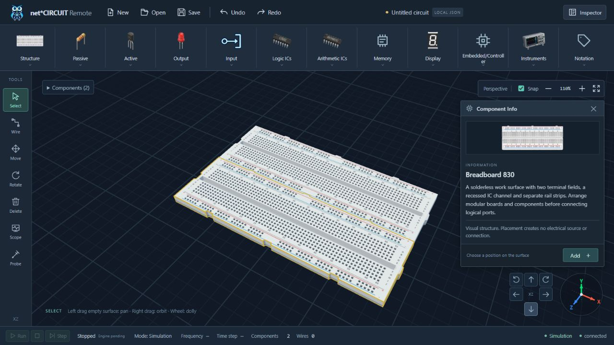
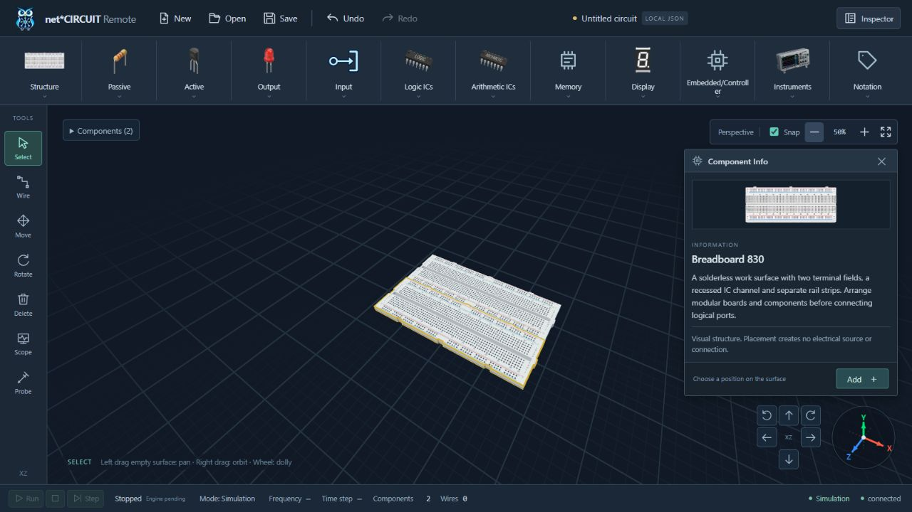

# Technical Workbench verification — 2026-10-09

## Automated checks

Final `cd apps/web && npm test`: **68/68 PASS**, including vue-tsc. Six regressions were RED before their respective fixes: requested 2px line unsupported by native LineSegments, socket centers capped by the deck, Info still open after deselection, no adaptive grid, mating keys without bevel clearance and straight docking edges overlapping.

Raycasts verify a cavity floor more than 0.05 below the top at first/middle/last sockets on each 830/630/100 model; geometry has sloped entrance normals. Existing instance-buffer disposal/count tests remain. A second raycast checks docked 830/830, 630/100 and 100/100 straight seams do not interpenetrate after bevelOffset -0.008. Stroke material stays 2 CSS px, gold #d4af37 and screen-based through resize/zoom. Grid render uniforms suppress minor detail at distant zoom while retaining major step 2.5. Picking, Move-only dragging/capture/cancel, history, graph and transport tests remain green.

`npm run build` in the sandbox passes the production TypeScript step, then fails with `[vite:build-html] EPERM ... realpath apps/web/src/main.ts`. No successful production bundle is claimed for this change. The earlier user decline of build elevation is respected; no repeat escalation was requested. Full npm tests use the authorized outside-sandbox execution because loopback tests otherwise receive EACCES.

Documentation/frontend/context checks: **17/17 PASS** (`tests/frontend`, `tests/test_docs_baseline.py`, `tests/integration/test_context_integrity.py`); `scripts/check_context.py` and `git diff --check` PASS. Independent review found no Critical/Important issue; its minor straight-seam bevel overlap was reproduced and corrected with the raycast regression described above.

## Browser / WebGL

Codex in-app browser at localhost:5173, session-local test draft:

1. Fresh empty circuit has no Component Info. No WORKSPACE/Untitled circuit caption exists inside the canvas stage; the normal file-bar title remains.
2. Added Breadboard 830 through Inspector: actual WebGL housing, Medium Gold border and Info appear; console warning/error list is empty.
3. Clicked Add Breadboard 830: graph count stays one, PLACE hint appears, and Info disappears (DOM count zero). Only canvas click commits the second board and opens its Info. Inspector confirms second position X=0/Y=0/Z≈2.66, matching the existing docking algorithm.
4. Orbit right twice (30°) and zoom 150% reveal sloped socket entrances/cavities. The contour stays clear; grid minor/major hierarchy is visible. The final bevel correction was rechecked in WebGL and screenshot refreshed.
5. Zoom 50%: minor grid detail recedes in distant regions; major lines and distance fade remain. Saved far-grid screenshot below. This is visual verification; no pixel benchmark is claimed.
6. Added 630 and 100 temporarily through Inspector: both artwork image bounds stay inside the art frame; computed transform is none. Undo restores the two-board draft. Selecting None hides Info (DOM count zero). Final selection restores Breadboard 830 panel.
7. At four desktop sizes, image/panel bounds are inside their containers; panel is above navigator, no horizontal overflow, caption count zero. Temporary viewport overrides reset after testing.
8. Final browser warning/error logs: `[]`. Kept the tab as a deliverable. Move-only interaction and genuine OrbitControls right-pointer behavior are covered by integration tests; this run does not claim native right-drag automation.

| Viewport | Artwork contained | Panel contained / above navigator | Horizontal overflow | Workspace caption |
|---|---|---|---|---|
| 1920×1080 | Yes | Yes | No | None |
| 1440×900 | Yes | Yes | No | None |
| 1366×768 | Yes | Yes | No | None |
| 1280×720 | Yes | Yes | No | None |

