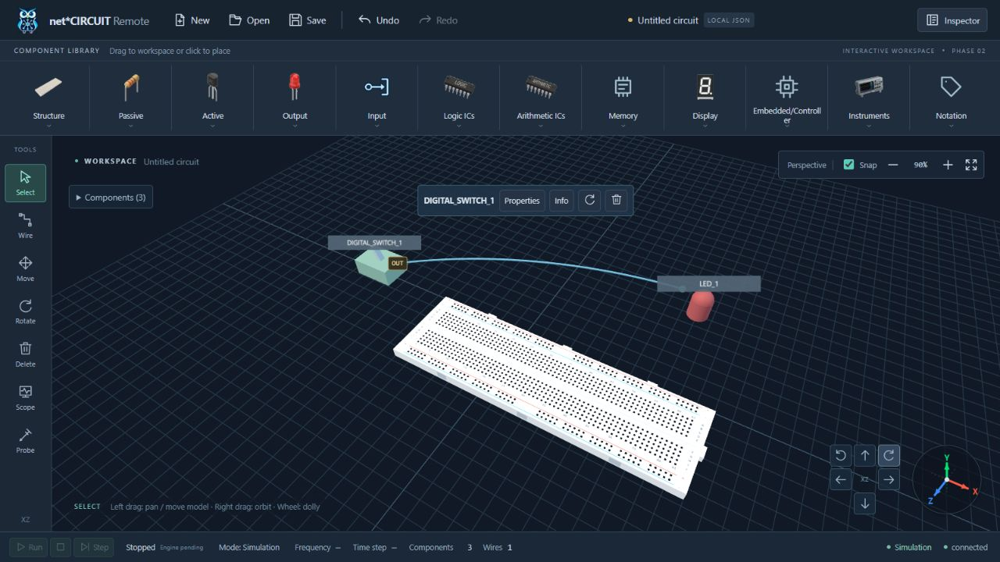

# Workspace navigation verification — 2026-10-09

**Historical report:** this records the earlier Select/Move drag implementation. The latest user request requires Move for direct model dragging; current 54-test/build/browser evidence is in [Move-only verification](2026-10-09-move-tool-browser.md). Pan/orbit/XYZ/layout evidence below remains relevant.

## Commands and results

| Verification | Result |
|---|---|
| `cd apps/web && npm test` | **53/53 PASS**, zero failures; vue-tsc included |
| `cd apps/web && npm run build` | **PASS**, 113 modules; JS 736.85 kB / gzip 220.74 kB |
| `python -m pytest -q tests services/api/tests services/hardware-service/tests simulator/circuit-simulator/tests` | **56/56 PASS**, three existing jsonschema/Starlette dependency deprecation warnings |
| `python scripts/check_context.py` | **PASS** |
| `git diff --check` | **PASS**; Windows LF/CRLF notices only |

Windows sandbox blocks localhost HTTP test connections and Vite realpath. These commands were rerun outside that sandbox; results above are the completed runs. Vite retains the existing >500 kB chunk advisory. No dependency changes, commit, push or hosted CI run were performed. Existing frontend CI runs npm tests/build plus boundary checks; equivalent local commands pass.

## RED → GREEN regression evidence

- Baseline browser: default Select left-drag did not move breadboard; SVG innerHTML was identical after Orbit right.
- New production editor/scene tests initially failed for missing Select model preview, empty-surface pan and camera-oriented axes. Existing tests passed outside sandbox.
- Corrected DOM-host fixture before judging the failures: GPU canvas contexts are unavailable in Node; real model picking/camera/history remain active.
- Low-camera reviewer finding reproduced with a visible LED at the supported orbit/dolly limits. Test failed because the ground intersection gate prevented capture; passed after using the picked surface interaction plane.
- Tests cover single release commit/Undo/Redo, no click/jitter snap, pointer identity, cancel/capture release, connected-wire preservation, selection/pending-wire retention during pan, Wire/Rotate semantics, orientation independence of translation/zoom, reset and genuine right-button OrbitControls pointer integration.

## Native browser verification

Codex in-app browser, `http://localhost:5173/`, actual WebGL scene and native left-button pointer drag. Backend event connection remained connected.

1. Added Breadboard from Structure ribbon. In default Select, drag moved it from X=-0.5/Z=0 to X=1.5/Z=1.5. One Undo restored the initial pose; Redo restored the moved pose.
2. Left-dragged empty surface diagonally; grid and models translated together, selection remained. Inspector retained X=1.5/Y=0/Z=1.5 after camera pan and view controls. Camera actions added no circuit command.
3. Orbit right three times (45°) visibly rotated the scene and changed SVG axis tips: X `(83,52)` → `(73.9203,68.2197)`, Z `(52,74.9381)` → `(30.0797,68.2197)`. Y stayed vertically oriented during horizontal orbit. Reset restored the view.
4. Clicked all six adjacent orbit/pan buttons. No View controls element remains; there are exactly six navigator buttons. Pan direction is camera-relative in the production scene math.
5. Gizmo center hit testing returns `CANVAS`; passive SVG/gaps do not intercept canvas gestures. Navigation buttons still receive click/focus.
6. Added Toggle switch and LED, connected `DIGITAL_SWITCH_1.OUT → LED_1.IN`. Default Select drag moved the switch from Z=-2.5 to Z=0; wire geometry followed its anchor. Inspector kept the same named endpoints and wire count 1. One Undo restored Z=-2.5 and retained the connection; Redo restored the move.
7. After the final interaction-plane fix, orbit 30°/zoom 90% and pan by native left drag: SVG axis tips stayed equal within `1e-8`, confirming pan did not rotate the axes. Breadboard remained directly draggable: X=1.5/Z=1.5 → X=2.5/Z=0.5. One Undo restored X=1.5/Z=1.5; three modules/one wire retained.
8. Browser warning/error log query returned `[]` after the final product changes.

Right-button native drag is not exposed by the current CUA browser drag API. It was verified by the production OrbitControls pointerdown/move/up integration test, including camera quaternion change, render callback axes update, release and reset after a left-gesture lock. Native right-drag browser automation is **not claimed**.

## Desktop layout

| Viewport | Horizontal overflow | Navigator inside workspace | Hint overlaps navigator | Buttons |
|---|---|---|---|---|
| 1920×1080 | No | Yes | No | 6 |
| 1440×900 | No | Yes | No | 6 |
| 1366×768 | No | Yes | No | 6 |
| 1280×720 | No | Yes | No | 6 |

Viewport override was reset after verification. No fabricated simulator output/hardware state is shown.

## Review disposition

One fresh read-only reviewer reported no Critical issue, one Important low-camera drag issue and one Minor pointer overlay issue. Both were addressed; the low-camera regression was confirmed RED → GREEN, and DOM hit testing confirmed the overlay correction. Multitouch and simulator/electrical implementation remain outside this mouse-navigation change.

