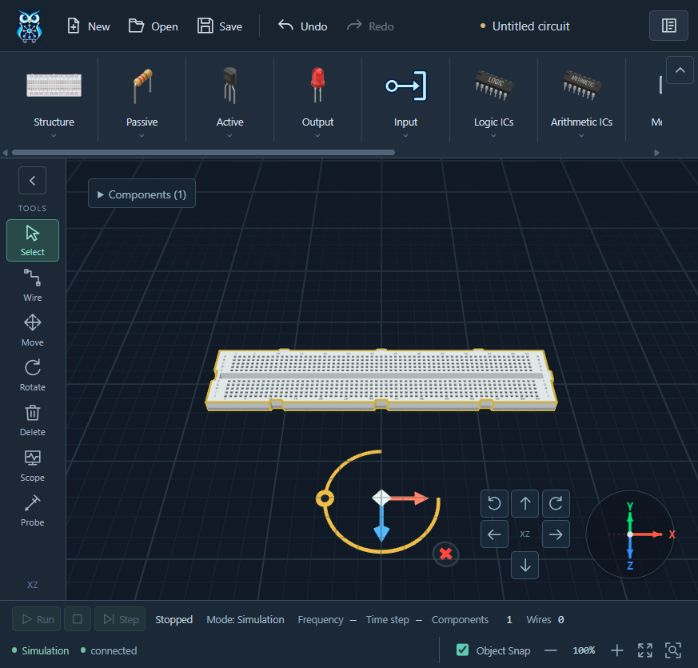
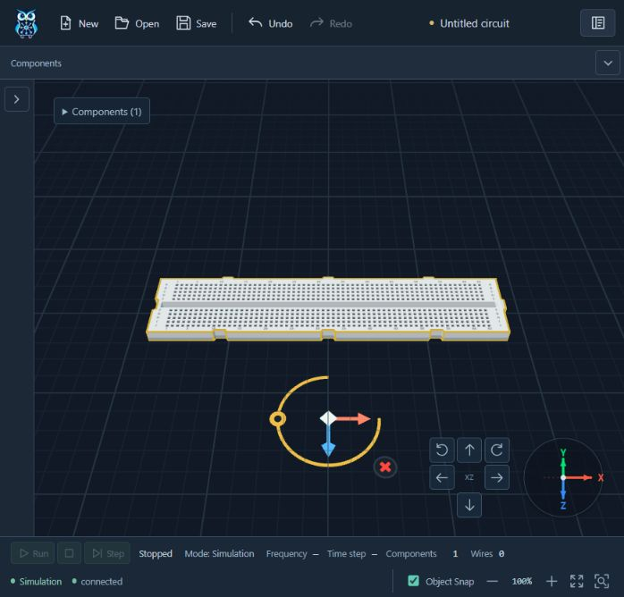

# Collapsible toolbar verification — 2026-10-11

## Automated evidence

- Frontend `npm test`: **163/163 PASS**, no failures/skips. Two new real-store cases failed before the flags/actions existed, then passed with the implementation. They exercise palette closure/hidden-state guard, independent state and graph/history/editor invariants.
- Production `npm run build`: **PASS**; existing bundle >500 kB advisory remains. Rebuilt after the minimum-height CSS correction.
- Independent read-only review: no outstanding material finding, including the short-height scrolling correction.
- Frontend boundary/docs/context and whitespace checks are recorded in DEV_LOG with their actual results.

## Native browser evidence

Local Vite `http://127.0.0.1:5173/`, real DOM/Three.js renderer. A disposable in-session Breadboard630 draft was created via Structure → Place → canvas; no circuit file was edited.

- Open Passive palette, select Move, collapse ribbon: palette removed, family toolbar absent from accessibility tree, Move remains selected and toggle keeps focus.
- Collapse rail independently: editing tools absent from accessibility tree; toggle remains visible. Reopen rail with Space and ribbon with Enter; Move remains selected and palette remains closed.
- Arm Breadboard630 placement, collapse both bars, click canvas: placement succeeds and component count becomes one. Subsequent toggles keep count one, Undo enabled and Redo disabled.
- Open Scope, collapse its rail, focus instrument header and Escape: window closes; focus returns to Expand tools sidebar. Scope stays the active editing mode.
- Arm Zoom To Area and collapse ribbon: existing resize handling cancels Area; no graph/history command is created.
- At minimum height560, reproduced Probe overlapping the status bar. After scoped CSS repair, Probe automatically scrolls into the list (bottom461 inside rail bottom492); the fixed toggle remains visible. Monitor window fits the stage height334.
- Initial hot reload retained the old Pinia store and produced a missing-action error. Intentional reload initialized the new store; no further warning/error entries appeared during final interaction checks. The log collector retains those earlier entries.

## Responsive layout

All four expanded/collapsed combinations were checked at each viewport. No horizontal document overflow; both toggles remain inside the viewport; active Scope survives all combinations.

| Viewport | Expanded canvas | Both collapsed canvas | Rail expanded → collapsed |
| --- | --- | --- | --- |
| 1280×720 | 1214×533.2 | 1242×592.2 | 66→38 |
| 1366×768 | 1300.4×581.2 | 1328.4×640.2 | 66→38 |
| 1920×1080 | 1854×893.2 | 1882×952.2 | 66→38 |
| 390×844 | 336.4×588.4 | 352.4×657.8 | 54→38 |
| Default compact browser | 632.4×442 | 660.4×511.4 | 66→38 |

Values are CSS pixels; fractional sizes reflect browser scaling. Temporary viewport overrides were reset. The final screenshot uses the default browser viewport and one placed Breadboard.

Scope: UI state, keyboard, viewport/scene/window integration. Backend/hardware execution is unchanged and was not re-tested in this UI task. Expanded is the reload default; no persistent preference was requested. No commit, push or deployment.
