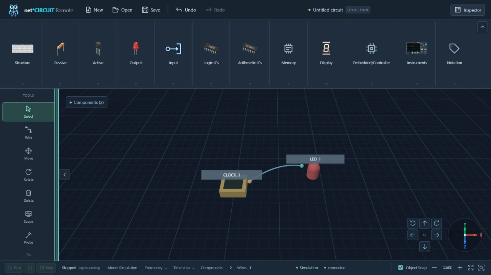
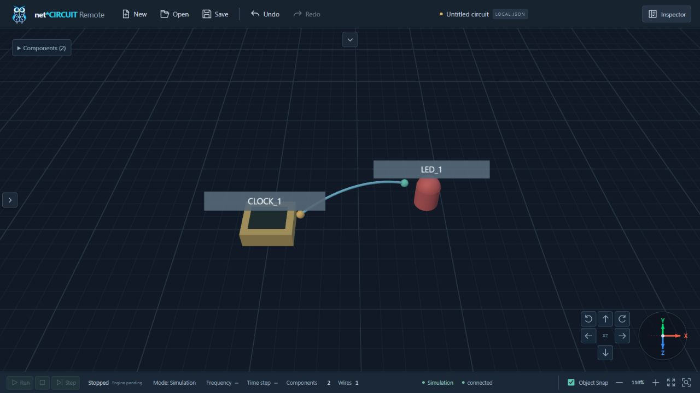

# Fully collapsible and resizable panels — 2026-10-11

Verified the local Vite application in the Codex browser using native clicks/drags and keyboard input. DOM inspection measured visible layout; no application-store mutations were used through browser evaluation. The preceding partial-collapse report is historical.

## Results

- Components: the complete section/header/content/background disappears and its wrapper height becomes exactly0. Tools: the complete aside disappears and its wrapper width becomes exactly0. Both edge buttons remain visible and keyboard accessible.
- Native separator drags changed initial106.2/66 px dimensions to171.2/128 px; collapse/reopen restored them with Enter/Space. Overshoot clamps to260/180 px; Home clamps to96/54 px. Final native drags set180/150 px, retained through smaller/larger viewports and collapse.
- A placed CLOCK_1 and LED_1 were connected through the existing Wire tool. Counts remain2 components/1 wire and displayed zoom110% throughout panel changes. The existing stopped simulation controls/mode/connection presentation remains present. Actual simulation execution is outside this feature's test scope.
- Scope opens normally. With Tools hidden, Escape on the instrument header closes Scope and focuses Expand Tools.
- The widened180 px rail initially intercepted Structure/Breadboard at the popup's center. DOM hit testing identified Wire as the hit target. After fixing stacking order, the hit target is Breadboard and a native click arms placement; Escape cancels normally.
- An initial stale Pinia HMR store logged `setWorkbenchSize is not a function`. Reload initialized the new store API; subsequent native verification produced no new warning/error entries. A batch attempted a moving toggle before its160 ms transition settled; the final measurements below were collected after settled native actions.

## Measured layout

Canvas dimensions are CSS pixels. Fractional values follow browser scaling/status wrapping. Every measured viewport had no horizontal document overflow.

| Viewport | State | Toolbar height | Tools width | Canvas |
| --- | --- | ---: | ---: | --- |
|1280×720|Components collapsed|0|180|1100×629|
|1280×720|Both collapsed|0|0|1280×629|
|1280×720|Tools collapsed|96|0|1280×533|
|1280×720|Both expanded, minimum height|96|180|1100×533|
|1280×720|Final resized dimensions|180|150|1130×449|
|390×480|Both expanded, responsive clamp|150.6|150|240.4×180|
|390×480|Both collapsed|0|0|390.4×330.6|
|320×480|Both collapsed|0|0|320×330.6|
|320×480|Both expanded, responsive clamp|150.6|120|200×180|
|390×844|Both expanded, preferences restored|180|150|240.4×514.6|
|1366×768|Both expanded|180|150|1216.4×497|
|1920×1080|Both expanded|180|150|1770×809|

At1280×720 fully collapsed, canvas rect equals the complete available workbench rect: x0,y52,width1280,height629. The top reopen button is x626/y58, and the left reopen button is x4/y352.5. Both hidden sections have zero client rects. Title/status still occupy their designed space.

## Automated verification

- `npm test`:171/171 PASS, no skips; production/test TypeScript checks included. Eight new cases cover preferred sizes, responsive limits, local pointer capture/cancel/release/teardown, keyboard resizing and SceneManager camera pose/magnification/model matrices/connections across repeated resize.
- `npm run build`:PASS,134 modules. Existing >500 kB chunk advisory remains; no dependency change.
- `python -m pytest -q tests/frontend tests/test_docs_baseline.py tests/integration/test_context_integrity.py`:17/17 PASS. `python scripts/check_context.py` and `git diff --check`:PASS. Full backend/hardware/FPGA suites were not rerun for this frontend-only feature.
- Independent scoped review found the palette stacking regression above; reproduced and corrected. No other material finding remains.

## Files changed

Production:

- `apps/web/src/components/workbench/SingleWorkspaceShell.vue`:available-layout observer/wrapper.
- `apps/web/src/components/workbench/ComponentRibbon.vue`:complete hidden section, floating toggle and height separator.
- `apps/web/src/components/workbench/ToolRail.vue`:complete hidden aside, floating toggle and width separator.
- `apps/web/src/components/workbench/CircuitWorkspace3D.vue`:gizmo obstacle bounds include floating toggles.
- `apps/web/src/components/windows/FloatingWindow.vue`:hidden-opener focus through outer wrappers.
- `apps/web/src/composables/usePanelResize.ts` (new):shared local resize lifecycle.
- `apps/web/src/stores/ui.ts`:preferred dimensions, available-layout size and limits.
- `apps/web/src/style.css`:zero-size layout, responsive constraints, separators, transitions and stacking.

Tests: `apps/web/tests/workbench.test.ts`, `apps/web/tests/panel-resize.test.ts` (new), `apps/web/tests/camera-navigation.test.ts`.

Documentation: `apps/web/README.md`, `docs/CONTEXT.md`, `docs/ARCHITECTURE.md`, `docs/ROADMAP.md`, `docs/CHANGELOG.md`, `docs/DEV_LOG.md`, `docs/SOURCE_ANALYSIS_COLLAPSIBLE_TOOLBARS.md`, this report and its two PNGs.

No icons, model factories/assets, electrical contracts, API/hardware logic, package dependencies or simulation implementation changed. No commit/push/deployment.
