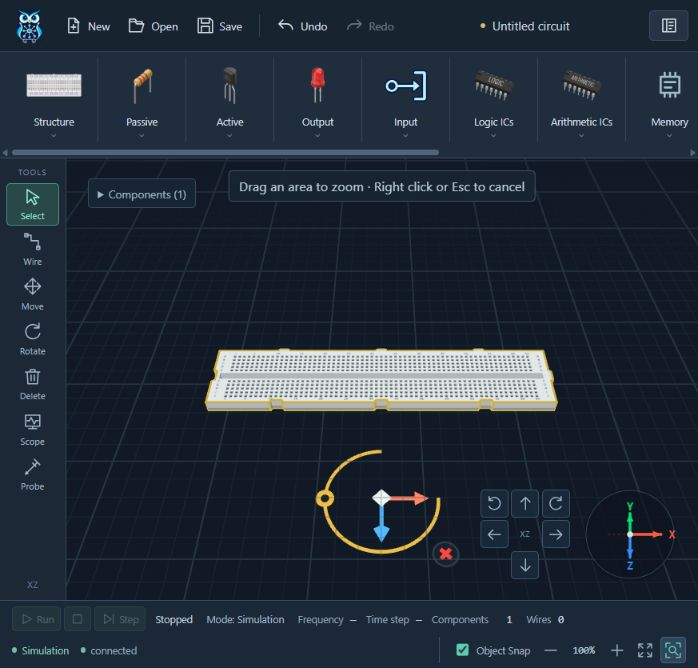

# Zoom To Area verification — 2026-10-11

## Automated evidence

| Check | Result |
| --- | --- |
| `npm test` (production/test TypeScript + real runtime tests) | 161/161 PASS, 0 skipped, 0 failures. |
| `npm run build` | PASS, 133 modules; existing >500 kB bundle advisory. |
| `python -m pytest -q tests services/api/tests services/hardware-service/tests simulator/circuit-simulator/tests` | 97/97 PASS; three existing jsonschema/Starlette deprecation warnings. Uses the existing ignored `.audit-runtime`, no dependency installation. |
| Context / whitespace | `python scripts/check_context.py` and `git diff --check` PASS. |

Windows sandbox blocked baseline loopback HTTP/gRPC and Vite realpath. Full tests/build/local server were rerun with approved execution outside the sandbox. The interrupted sandbox Python run is not counted as a passing run.

Eight new runtime tests exercised camera focus/frame depth, heading/aspect, invalid/inactive input, wheel/toolbar reversibility, gesture priority and graph/history invariants, retry/cancellation, right-button chord contextmenu, zero viewport, Tab and capture lifetime. Tests were observed failing before implementation/fixes. Independent review reproduced the foreground center and near-edge clipping defects; both received failing regressions before correction. Exact floating-point magnification checks use tolerance; the visible toolbar remains rounded to two decimals.

## Browser interaction

Codex in-app browser against local Vite `http://127.0.0.1:5173/`; real Three.js WebGL renderer, real DOM pointer/capture and current source. A temporary session draft containing one Breadboard 630 was created through Structure → Place → canvas; no circuit file was changed.

- Verified DOM order: Zoom Out, Zoom In, Zoom To View Entire Circuit, Zoom To Area; the new button is immediately right of Fit.
- Verified title attributes: `Zoom Out`, `Zoom In`, `Zoom To View Entire Circuit`, `Zoom To Area`, without the old colon descriptions.
- Fit frames the breadboard. Activating Area focuses canvas, shows the short instruction/crosshair and sets aria-pressed true.
- Native reverse drag `(450,430) → (300,330)` frames a breadboard region; aria-pressed returns false, rectangle/instruction disappear, the view is magnified and component count remains one. Repeated on final depth-fitting source.
- Escape cancels the armed mode. Camera-only behavior, graph/history preservation and the additional cancellation cases are covered by the real editor/scene runtime tests.
- Final browser warning/error logs are empty.

## Responsive measurements

| Viewport | Right edge of Area button | Body horizontal overflow | Canvas height |
| --- | --- | --- | --- |
| 1280×720 | 1268 px | none | 533.2 px |
| 1366×768 | 1354.4 px | none | 581.2 px |
| 1920×1080 | 1908 px | none | 893.2 px |

The default compact viewport also keeps all buttons visible and wraps the status bar. Temporary viewport overrides were reset after testing.

Scope: navigation/editor integration, not simulation execution, FPGA integration or deployed hardware testing. Original supplied artwork and circuit/hardware contracts were preserved. No commit, push or deployment performed.
